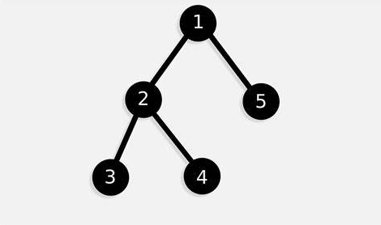
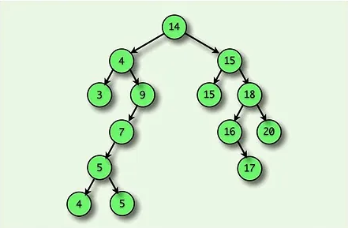

# TDA ABB

## Alumno: Chiara Vijande - 111771 - cvijande@fi.uba.ar

- Para compilar:

gcc -o pruebas pruebas_alumno.c src/abb.c -I. -Wall -Werror -g

- Para ejecutar:

./pruebas

- Para ejecutar con valgrind:

valgrind --leak-check=full --track-origins=yes --show-leak-kinds=all ./pruebas

##  Funcionamiento

El programa implementa un Árbol Binario de Búsqueda (ABB), y permite realizar inserciones, eliminaciones, búsquedas y recorridos sobre el ABB.

Su funcionamiento en general consiste en la creación del ABB (con la función abb_crear, la cual permite inicializar un ABB vacío con un comparador de elementos), la inserción de elementos (con la función abb_insertar), la búsqueda de elementos y la verificación de sus existencias (con las funciones abb_buscar y abb_existe), la eliminación de elementos (con la función abb_sacar), el recorrido de forma preorden, inorden o postorden (especificado por enum abb_recorrido), y la destrucción del ABB (con abb_destruir y abb_destruir_todo).

En el siguiente diagrama, se puede ver cómo funciona el programa a grandes rasgos:

En el siguiente diagrama, vemos cómo funciona la asignación de memoria tanto para el ABB, como para sus nodos:

Este diagrama muestra cómo se asigna la memoria para cada elemento en las siguientes funciones:

abb_t *abb_crear(int (*cmp)(const void *, const void *))
{
	if (!cmp)
		return NULL;

	abb_t *abb = malloc(sizeof(abb_t));
	if (!abb)
		return NULL;

	abb->comparador = cmp;
	abb->raiz = NULL;
	abb->nodos = 0;

	return abb;
}

bool insertar_nodo(nodo_t **nodo, nodo_t *nuevo,
		   int (*comparador)(const void *, const void *))
{
	if (!*nodo) {
		*nodo = nuevo;
		return true;
	}

	if (!nuevo->elemento || !(*nodo)->elemento) {
		if (!nuevo->elemento && !(*nodo)->elemento)
			return insertar_nodo(
				&(*nodo)->izq, nuevo,
				comparador); 
		else if (!nuevo->elemento)
			return insertar_nodo(
				&(*nodo)->izq, nuevo,
				comparador); 
		else
			return insertar_nodo(&(*nodo)->der, nuevo, comparador);
	}

	int cmp_result = comparador(nuevo->elemento, (*nodo)->elemento);
	if (cmp_result <= 0) {
		return insertar_nodo(&(*nodo)->izq, nuevo, comparador);
	} else {
		return insertar_nodo(&(*nodo)->der, nuevo, comparador);
	}
}

bool abb_insertar(abb_t *abb, const void *elemento)
{
	if (!abb)
		return false; 

	nodo_t *nuevo = malloc(sizeof(nodo_t));
	if (!nuevo)
		return false;

	nuevo->elemento = (void *)
		elemento;
	nuevo->izq = NULL;
	nuevo->der = NULL;

	bool resultado = insertar_nodo(&abb->raiz, nuevo, abb->comparador);
	if (resultado)
		abb->nodos++;

	return resultado;
}

teniendo en cuenta las estructuras creadas en abb_estructura_privada.h:

typedef struct nodo_t {
	void *elemento;
	struct nodo_t *izq;
	struct nodo_t *der;
} nodo_t;

struct abb_t {
	size_t nodos;
	nodo_t *raiz;
	int (*comparador)(const void *, const void *);
};

Decisiones tomadas en la implementación del ABB, y en el diseño del programa:

-Función abb_insertar():
En esta función se decidió implementar una combinación de recursión e iteración para asegurar una inserción eficiente y clara, respetando la estructura ordenada del ABB. Cada nodo se reserva con malloc() para permitir la expansión dinámica del ABB sin restricciones de tamaño. Luego, se usa una función auxiliar insertar_nodo() para que la función esté más modularizada. Si hay un elemento repetido, se coloca en el subárbol izquierdo del elemento existente.
Con respecto a la complejidad del algoritmo, en el mejor caso (árbol balanceado), sería O(log(n)), ya que la profundidad del árbol es logarítmica respecto a la cantidad de nodos, y en el peor (árbol desbalanceado), O(n), ya que el ABB se convierte en una lista enlazada y cada inserción recorre todos los nodos.

-Función abb_existe(): esta función se encarga de determinar si un elemento está presente en el ABB. Se implementó de manera iterativa, recorriendo el árbol desde la raíz hasta encontrar el elemento o llegar a un nodo NULL. Se eligió una implementación iterativa en lugar de recursiva para evitar sobrecarga en la pila y mejorar la eficiencia en árboles grandes.
Con respecto a la complejidad del algoritmo, en el mejor caso (árbol balanceado), sería O(log(n)), donde la búsqueda sigue el camino óptimo hasta encontrar el nodo, y en el peor (árbol desbalanceado), sería O(n), si el ABB se comporta como una lista enlazada.

-Función abb_buscar(): esta función se implementó utilizando búsqueda iterativa, lo que evita la sobrecarga de la pila y mejora la eficiencia en comparación con una versión recursiva (esto es porque la versión iterativa mantiene el recorrido dentro de un solo frame, reduciendo el consumo de memoria).
Con respecto a la complejidad del algoritmo, en el mejor caso (árbol balanceado), sería O(log (n)), ya que cada comparación reduce el espacio de búsqueda a la mitad, y en el peor (árbol desbalanceado), sería O(n), si el ABB se comporta como una lista enlazada y se deben recorrer todos los nodos.

-Función abb_sacar(): permite buscar un elemento en el Árbol Binario de Búsqueda (ABB) y eliminarlo, reorganizando la estructura para mantener sus propiedades. Se decidió diseñarla utilizando una combinación de recursión y manejo explícito de punteros para garantizar una eliminación eficiente. En el caso de su función auxiliar eliminar_nodo_postorden(), se optó por un enfoque recursivo para simplificar la búsqueda del nodo a eliminar y garantizar una estructura limpia después de la eliminación. Particularmente, en esta función auxiliar, en un principio tuve una dificultad para encontrar un problema de gestión de memoria, ya que al liberar un nodo sin antes actualizar sus referencias, se generaban accesos inválidos. Para resolverlo, aseguré que nodo apuntara a NULL antes de liberar la memoria asignada, evitando referencias colgantes y errores de acceso. También, me pasó un problema similar en abb_sacar(), que resolví validando que tanto *abb como *elemento no fueran nulos antes de proceder con la eliminación, evitando fallos y asegurando una ejecución segura.
Con respecto a la complejidad del algoritmo, en el mejor caso (árbol balanceado), sería O(log (n)), pues la eliminación sigue la lógica de búsqueda del ABB, y en el peor, sería O(n), si el árbol se comporta como una lista enlazada y se deben recorrer todos los nodos.

-Función abb_vacio(): Determina si un ABB está vacío, considerando también como vacío el caso en que el ABB no exista (NULL). La función primero verifica si abb == NULL, devolviendo true inmediatamente. Luego, consulta abb->nodos == 0 para determinar si el árbol realmente no tiene elementos. Se decidió implementarla de esta forma, ya que así se evita recorrer la estructura innecesariamente, usando una verificación de un solo paso (abb->nodos). 
Con respecto a la complejidad del algoritmo, sería O(1), ya que solo lee un valor (abb->nodos), sin la necesidad de recorrer el ABB. Esta misma complejidad tiene la función de abb_tamanio(), ya que accede directamente al mismo valor para verificar la cantidad de elementos.

-Función abb_recorrer(): Recorre el ABB en el orden indicado (preorden, inorden o postorden) y aplica una función f a cada elemento. Se implementó de forma recursiva, asegurando una navegación estructurada y eficiente. Se eligió recursión para reflejar la estructura natural del árbol, evitando la complejidad de una implementación iterativa con una pila manual.
La complejidad de esta función (o más bien, de su función auxiliares recorrer_preorden(), recorrer_inorden() y recorrer_postorden()) sería O(n), ya que se visita cada nodo exactamente una vez, independientemente del tipo de recorrido.

-Función abb_vectorizar(): Recorre el ABB en el orden indicado y almacena los elementos en un vector, sin exceder la capacidad establecida. Se implementó de manera recursiva, aprovechando la estructura natural del ABB, y se optó por esta manera para recorrer el árbol de manera estructurada sin necesidad de una pila auxiliar. Se mantiene un contador (size_t *contador) para asegurarse de que no se exceda la capacidad del vector.
La complejidad de esta función sería O(n), ya que se visita cada nodo una sola vez, asegurando eficiencia en la vectorización.

-Funciones abb_destruir() y abb_destruir_todo(): Estas funciones liberan toda la memoria utilizada por el ABB. La diferencia entre ellas es que abb_destruir_todo() también aplica una función destructor sobre cada elemento antes de eliminar los nodos. Se implementaron utilizando recursión, lo que facilita la liberación ordenada de los nodos, y sin tener la necesidad de estructuras auxiliares.
La complejidad de ambas funciones sería de O(n), ya que se recorre y libera cada nodo una sola vez, asegurando eficiencia.

## Respuestas a las preguntas teóricas
					¿Qué es un árbol?
Un árbol es una estructura de datos jerárquica que consiste en nodos conectados mediante aristas (enlaces). Se utiliza para representar relaciones padre-hijo en sistemas organizados, y tiene las siguientes características:
- Hay un único nodo raíz, que es el punto de inicio del árbol.
- Cada nodo puede tener cero o más hijos.
- No hay ciclos: no se puede volver al nodo padre siguiendo los enlaces.

Ejemplo de aplicación: Una estructura de datos que muestre todas las materias de una carrera de grado, y cuáles son correlativas entre sí (es decir, cuáles se tienen que tener aprobadas para cursar una materia en particular - en este caso una materia sería un nodo -).

					¿Qué es un árbol binario?
Un árbol binario es un caso especial de árbol donde cada nodo tiene como máximo dos hijos: izquierdo y derecho. 

Ejemplo de aplicación: Un conjunto de números ordenados de mayor a menor, donde hay un número X como nodo raíz, y su nodo hijo derecho es un número menor a él, y su nodo hijo izquierdo es un número mayor a él. Así se sigue sucesivamente la regla de que los números más chicos van a la derecha, y los números más grandes a la izquierda.

					¿Qué es un árbol binario de búsqueda (ABB)?
Un árbol binario de búsqueda (ABB) es un árbol binario donde cada nodo cumple las siguientes reglas:
- Los valores en el subárbol izquierdo son menores que el nodo actual.
- Los valores en el subárbol derecho son mayores que el nodo actual.

Ejemplo de aplicación : Una base de datos donde se necesita que sus datos estén ordenados para que puedan ser buscados e insertados eficientemente.

